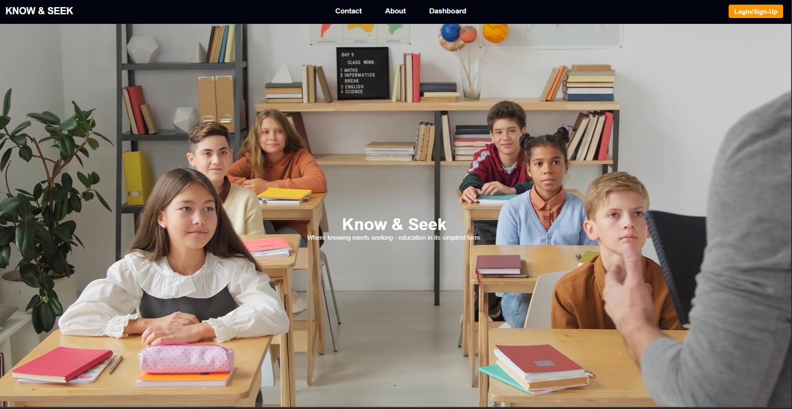
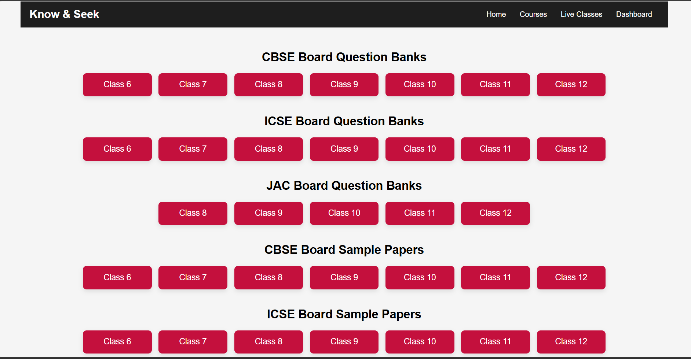

# 📚 Know & Seek – Educational Resource Platform  

📊 A centralized platform to access study materials, notes, and videos for students (Class 1–12)  

## 📌 Overview  
**Know & Seek** is a web-based platform designed to simplify learning by providing students with a single place to access educational resources.  

Instead of searching across multiple websites, users can find notes, videos, question banks, and sample papers organized subject-wise and class-wise.

The platform focuses on:
- Easy accessibility of learning materials  
- Organized content structure  
- Reducing dependency on multiple sources  

---

## 📸 Application Preview  

| Homepage | Content Page |
|----------|-------------|
|  |  |

---

## 🚀 Features  

- 📚 Access study materials for Class 1–12  
- 🎥 Curated video resources for different subjects  
- 📝 Notes, question banks, and sample papers  
- 🔍 Easy navigation between subjects and topics  
- 🌐 Centralized platform for multiple resources  

---

## 🛠️ Tech Stack  

- **Frontend:** HTML, CSS, JavaScript  
- **Backend:** PHP (basic usage)  

---

## 📂 Content Handling  

### Resources Included:
- Subject-wise notes  
- Video links  
- Question banks  
- Sample papers  

---

## ⚙️ How It Works  

1. User visits the platform  
2. Selects class and subject  
3. Views available notes, videos, and resources  
4. Navigates through structured content  
5. Accesses learning materials easily from one place  

---

## 🎯 Project Purpose  

To reduce the difficulty students face while searching for educational content by providing a centralized and organized learning platform.

---

## 💡 Future Improvements  

- 🔐 User login system  
- 📊 Personalized recommendations  
- 📱 Mobile-friendly UI improvements  
- 🧠 AI-based content suggestions  
- 💾 Database integration for dynamic content  

---

## ⚠️ Note  
This platform organizes and provides access to publicly available educational resources for learning purposes.

---

## 👨‍💻 Author  

**Awesh Hussain**  
GitHub: https://github.com/AweshHussain  
